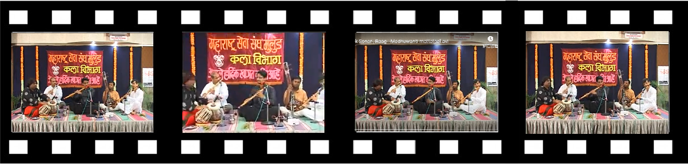

# *FGAVE*: A Dataset for Fine-Grained Audio-Visual Event Localization




## Overview

Audio-visual event localization (AVEL) task aims to localize the sound events in  corresponding visual segments temporally, better performance on an AVEL task  could facilitate video understanding in cross-modality realm.  In reality, the very  minor change of continuous visual/auditory scenes with different labels makes the  temporal boundaries indistinguishable.  For example, it s difficult to find flute sound  from the video segments of the concert scene. The cause of this problem is lacking semantic information in two modalities.  In this paper, we propose a fine-grained AVE dataset, FGAVE, to promote researches  on AVEL task in the realistic realm.  FGAVE consists of a series of autonomous  sensory meridian response (ASMR) videos with a relatively still visual background.   Through a systematic annotation and filter procedure, our FGAVE dataset consists  of 14,464 videos with a fixed length of 10 seconds, covering a wide variety of  sound sources triggered by different actions with different material.  In benchmark  tasks, we perform several experiments on the two sub-tasks to evaluate our finegrained  AVE dataset and demonstrate the challenges and usefulness of semantic  annotations in AVEL problem.

### Access Form

If you would like to download the FGAVE dataset, please fill out the form

```
data/License_Agreement.pdf
```
and send it to [inspur mailbox](liulu06@inspur.com). Once accepted, we will send you the link to our download script.sh.


### Benchmark Comparison

To analyze the fine-grained  level of our dataset, we perform the classification experiments using three transformer-based methods. Moreover, we propose a set of benchmark results on our FGAVE dataset and previous AVE dataset in  audio-visual event localization task, so that we could have a fair comparison on the difficulties of  matching auditory and visual modalities in similar scenes.

 - Fine-Grained Audio Classification
 
 
![The quantitative results on ESC-50 and our FGAVE-Audio.  PLSA, AST and PaSST are three advanced methods in audio classification.  PLSA+ImageNet Pretrain denotes as a transformerbased  model pretrained with ImageNet.  ACC, mAP, AUC is the evaluation metrics, shorted for  accuracy, mean average precision and area under curve.  First, PaSST performs the best in three  models (comparing three values with wavy line).  Second, three models have better distinguishing  ability in material categorization than action (comparing two values in underline).  Third, pure audios  of our FGAVE is more difficult to identify than ESC-50 (comparing three values in bold).](./images/Snipaste_2022-06-14_18-28-27.png)
	
	
- Audio-Visual Event Localization

![The results of AVEL task in AVE and our FGAVE dataset.  First, FGAVE is harder to  capture feature than AVE in both auditory and visual modalities (our values in bold are lower in both  sub-tasks).  Second, the changes of the visual frames in our FGAVE is small (the barely changed  values in the underline means it is not enough visual changes to make it differs).  Third, the results of  A2V is higher than V2A in shuffle audio mode, due to the disordered auditory information is less than  it in in-ordered videos in A2V mode (comparing two values in wave line).  Fourth, gaining semantic  information is introduced in training procedure the results turns lower (18.59 to 21.89 in boxes).  It  reveals the difference between categories are small and our FGAVE is fine-grained in multi-modality.](./images/Snipaste_2022-06-14_18-36-20.png)


## Contact

If you have any questions, please contact us at [hss_lab mailbox](liulu06@inspur.com)

